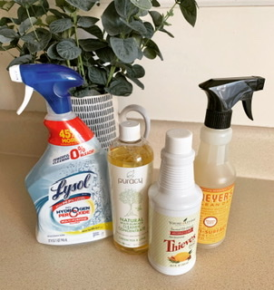

## Multi-Purpose Cleaners

One of the first things I wanted to change in my journey to reduce toxins was my cleaners. I was tried of getting dizzy, headaches, and coughing every time I tried to clean. These are four less toxic cleaners I have been trying for the past few weeks. I want to share my thoughts, the EWG ratings, and approximate prices. 

### 1. Thieves

This product from Young Living is amazing. I can clean my kitchen, bathrooms, mirrors, or even dust with this cleaner, and it smells AMAZING! I purchased this cleaner concentrate so I just use one cap full for one spray bottle of water. EWG rates this product a “B”, and it is $30, but it should last quite a long time.

[Thieves Cleaner](https://www.youngliving.com/en_US/products/thieves-household-cleaner)

### 2. Puracy

This product is also a concentrate, and I used it for everything just like Thieves. It smells very nice, but I prefer Thieves. I think this is a great option as it is $15 on Amazon, and EWG awarded an “A” rating. 

[Puracy Cleaner](https://www.amazon.com/Puracy-Natural-Purpose-Concentrate-Streak-Free/dp/B00T56KW8K)

### 3. Lysol Power & Free

I was surprised that a Lysol product could have an “A” rating from EWG, but this one does, and doesn’t make me cough or make me dizzy. It also smells quite nice! It can be purchased at any grocery store for less than $10. I use this on countertops and bathrooms but not on glass. 

### 4. Mrs. Meyers

This product is an example of something claiming to be all natural but not being completely as it appears. This product in this scent received a “D” rating from EWG mostly from ingredients related to the fragrance. Other Mrs. Meyers scents receive better scores. This product can be purchased at many grocery stores for less than $10. I use this on countertops and bathrooms but not on glass. 

