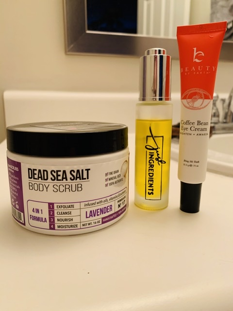

## At Home Spa

I can't be the only one that comes home at the end of the day worked up, stressed, or discourage by all the virus talk. Stress can wear down our immune systems which opens us up to sickness. 

Today I decided to sweat it out with a cadio work out and then use these three products to treat myself to an at home spa. I immediately felt the stress melt away. All of these products are all natural and free of harsh chemicals and toxins. Plus, they are three of my favorites! See the links below. 
 
[Dead Sea Salt Scrub](https://purescrubs.com/collections/dead-sea-salt-body-scrubs/products/lavender-body-scrub-dead-sea-salt-premium-blend-17)

[Just Ingredients Face Serum](https://justingredientswithkaralynne.com/products/face-serum)

[Beauty by Earth Eye Cream](https://www.beautybyearth.com/product/natural-eye-cream/)
